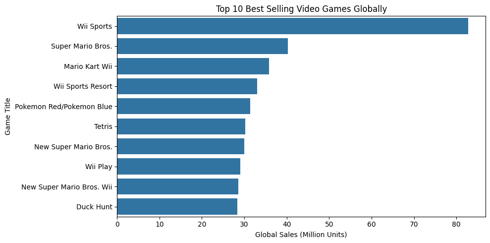
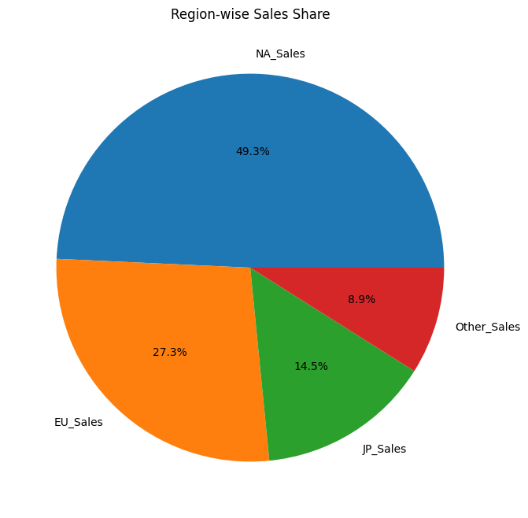
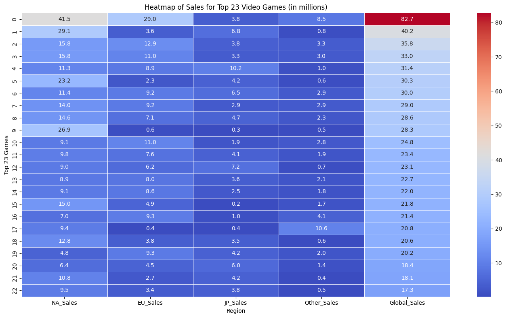

# 🎮 Video Game Sales Analysis

This repository contains a complete exploratory data analysis on **Video Game Sales data**, uncovering global market patterns across platforms, genres, and publishers. The goal is to derive insights about sales performance, gaming trends over years, and factors influencing global popularity. The project is done using Python with visual analytical interpretation.

---

## 🔍 Project Overview

Video gaming is a multi-billion-dollar industry, and understanding what sells can help predict future trends.  
This notebook performs:

- Data loading and cleaning
- Exploratory Data Analysis (EDA)
- Sales pattern comparison across regions
- Findings based on platforms, genres, publishers, and year-wise trends
- Visual insights with charts and distribution plots

---

## 🧠 Key Highlights

- Identified **top-selling games globally**
- Compared **genre popularity and platform dominance**
- Observed **publisher-wise performance**
- Region-wise sales patterns: North America, Europe, Japan, Others
- Generated multiple **visual plots for interpretation**

---

## 📊 Visual Outputs Generated

## TOP 10 Best Selling games



## Region-Wise Sales Shares



## Heatmap For Top 23 Video Games




---

## 📁 Folder Structure
```bash
Video_Game_Sales_Analysis/
│── Video_game_sales_Analysis.ipynb # Main analysis notebook
│── vgsales.csv # Source dataset
│── images # Few plot images 
└── README.md # Project documentation
```
---


---

## 🗂 Dataset Information

Dataset used: **vgsales.csv**


| Column | Description |
|-------|-------------|
| Name | Game title |
| Platform | Console/Device platform |
| Year | Release year |
| Genre | Type/category of game |
| Publisher | Game publishing company |
| NA_Sales | North America sales (millions) |
| EU_Sales | Europe sales (millions) |
| JP_Sales | Japan sales (millions) |
| Other_Sales | Sales in other regions |
| Global_Sales | Worldwide total sales |

Data Source link: https://www.kaggle.com/datasets/anandshaw2001/video-game-sales

---

## 🛠 Tech Stack

| Tool/Library | Usage |
|-------------|--------|
| Python | Core programming |
| Pandas | Data analysis and preprocessing |
| NumPy | Numerical computing |
| Matplotlib | Data visualization |
| Seaborn | Statistical plotting |

---

## 📥 Installation Process

```bash
git clone <repository_url>
cd Video_Game_Sales_Analysis
pip install pandas numpy matplotlib seaborn
```

### RUN The Project 
```bash
jupyter notebook Video_game_sales_EDA.ipynb
```


